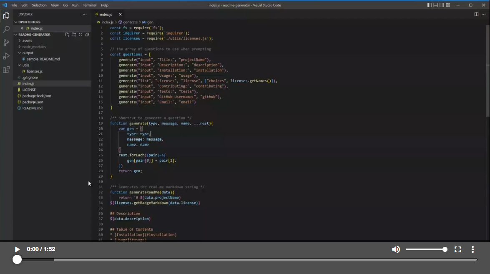

# README.md Generator


## Description
A command-line application that dynamically generates a professional README.md file from a user's input using the [Inquirer package](https://www.npmjs.com/package/inquirer/v/8.2.4).

## Table of Contents
* [Installation](#installation)
* [Usage](#usage)
* [Contributing](#contributing)
* [Tests](#tests)
* [License](#license)
* [Questions](#questions)

## Installation
Open the directory in terminal and run:
```
node install
node index.js
```

## Usage
The application will begin prompting the user for questions about their project. Upon completion, a README.md will be generated in the 'output' directory.

[](https://watch.screencastify.com/v/twLY04mwLhYKozgIesQN)

## Contributing
Contributions are welcome, contact info is below.

## Tests
There is a [sample-README.md](/output/sample-README.md) file in the output directory. 

## License
The test project is under the [MIT License](http://choosealicense.com/licenses/mit/). See the link for more details.

## Questions
GitHub: [vicdotexe](https://www.github.com/vicdotexe)

E-mail: [vicdotexe@gmail.com](mailto:vicdotexe@gmail.com)
